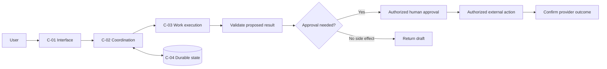

# Architecture template

Reference design unless supported by actual code/configuration evidence. Component IDs are proposed labels, not repository paths.

## Decision and scope

Recommended shape: [design].
Reason: [user outcome and tradeoff].
Existing verified system: [evidence or unknown].
Proposed changes: [explicit boundary].

## Request path

Explain one request in ordinary language. Name who validates, who stores durable state, who approves a side effect, and who confirms its outcome.

This is an illustrative diagram. Remove coordination, workers, or external actions when the scenario does not need them. Do not depict this as Codelit's actual implementation.

## Components and contracts

| ID | Responsibility | Inputs/outputs | State owner | Access boundary |
|---|---|---|---|---|
| C-01 | [job] | [contract] | [owner or no storage] | [identity/scope] |

## Failure behavior

| Failure | Detection | Preserved state | Recovery | Proof needed |
|---|---|---|---|---|
| [failure] | [signal] | [checkpoint] | [safe next step] | [observed evidence] |

For relevant side effects, cover duplicate delivery, approval expiry, changed payload, cancellation, and a provider timeout after possible completion. Define idempotency scope without promising unsupported exactly-once effects.

## Decisions and verification

Explain the preferred design and one meaningful alternative. Identify tenant isolation, secrets handling, validation, logging/redaction, and retention decisions required by the use case. Mark unknown policies as unknown.

Link P-requirements to C-components and T-tests. Identify actual versus proposed test commands. Describe rollout and rollback or compensating action, plus evidence still needed before release.

## Related Codelit templates

[Explore Architecture templates in Codelit](https://codelit.io/templates)

This link opens a public Codelit page; it does not save or transfer this draft. Replace it with a verified matching public template when appropriate. Omit this section when the user requests no links.
